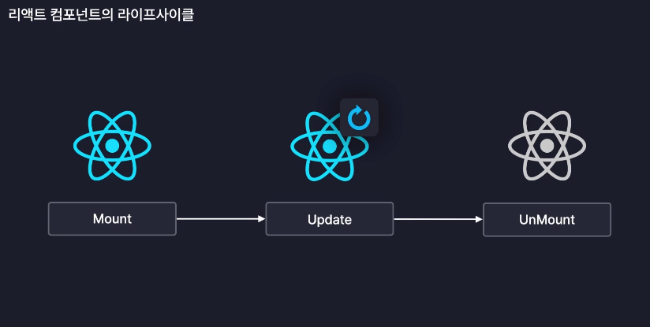
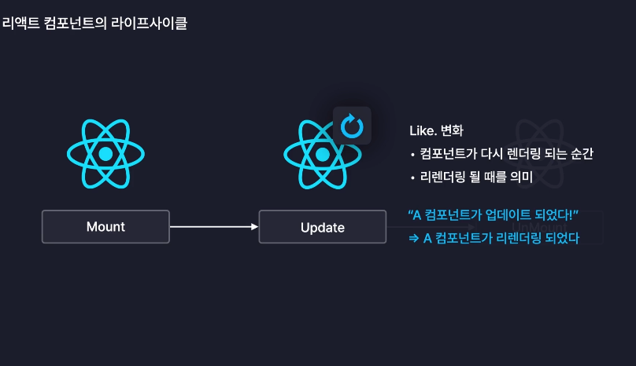
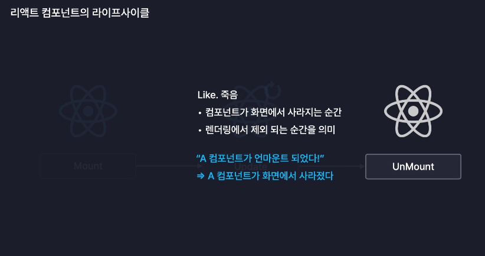

# 라이프사이클

## 라이프사이클(LifeCycle)이란?

-   생애 주기

## 리액트 컴포넌트의 라이프사이클

-   리액트의 컴포넌트도 인간과 비슷한 라이프사이클을 갖는다.
    
    1. Mount : 탄샌
        - 컴포넌트가 탄생하는 순간 => "A 컴포넌트가 Mout 되었다."
        - 화면에 처음 렌더링 되는 순간 => "A 컴포넌트가 화면에 처음으로 렌더링 되었다."
          
    2. Update :변화, 리렌더링
    -   컴포넌트가 다시 렌더링 되는 순간 => "A 컴포넌트가 업데이트 되었다."
    -   리렌더링 될 때를 의미 => "A 컴포넌트가 리렌더링 되었다."
        
    1. UnMount : 죽음
    -   컴포넌트가 화면에서 사라지는 순간 => "A 컴포넌트가 언마운트 되었다!"
    -   렌더링에서 제외 되는 순간을 의미 => "A 컴포넌트가 화면에서 사라졌다."
        

## 라이프사이클 제어

-   컴포넌트의 라이프 사이클의 단계별로 각각 다른 작업을 수행하도록 만드는 것
-   Mount -> 서버에서 데이를 불러오는 작업
-   Update -> 어떤 값이 변경되었는지 콘솔에 출력
-   UnMount -> 컴포넌트가 사용하던 메모리 정리
-   useEffect 훅을 사용하여 라이프사이클 제어를 손쉽게 구현할 수 있다.
