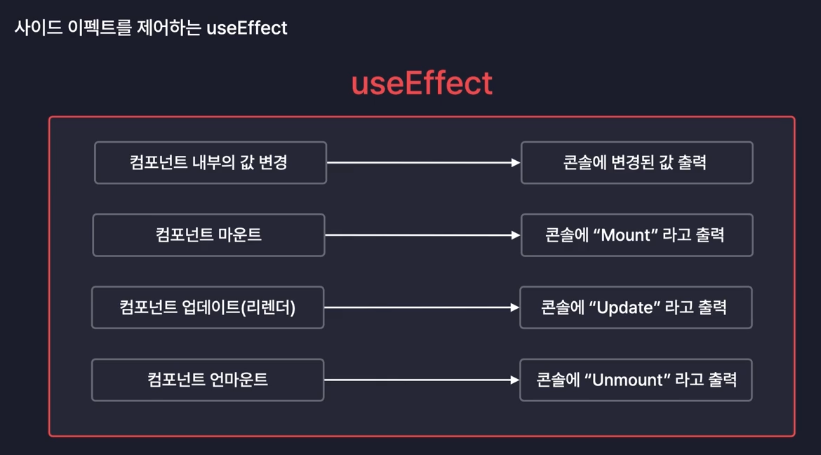

# useEffect 사용하기

## useEffect란?

-   리액트 컴포넌트의 **사이드 이펙트**를 제어하는 새로운 React Hook

## 사이드 이펙트(Side Effect)란?

-   우리말로 **부작용** 이라는 뜻
-   리액트에서는 **"부수적인 효과", "파생되는 효과"** 정도로 해석 가능
-   리액트 컴포넌트의 사이드 이펙트는 컴포넌트의 동작에 따라 **파생되는 여러 효과**
-   예시 : 라이프 사이클을 제어하는 것
    
-   useEffect를 이용하면 사이드 이펙트를 우리가 새롭게 만들거나 또는 제어할 수 있다.
    -   컴포넌트에 어떤 값이 변경되었을 때 특정 코드를 실행
    -   라이프 사이클을 제어하는 것 : Mount, Update, UnMount 때 특정 코드를 실행시키는 것을 만들 수 있다.
    -
