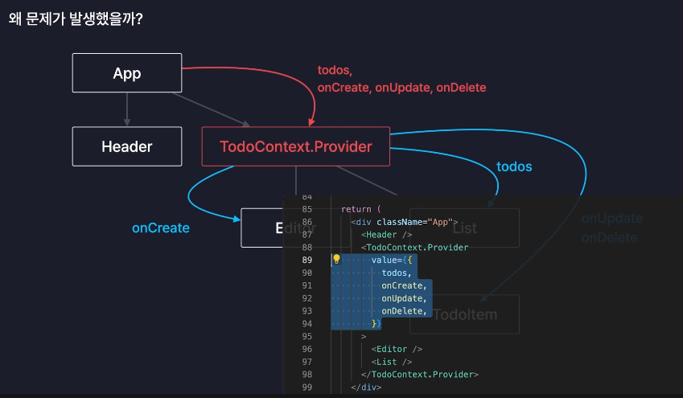
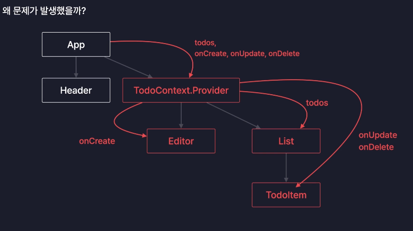
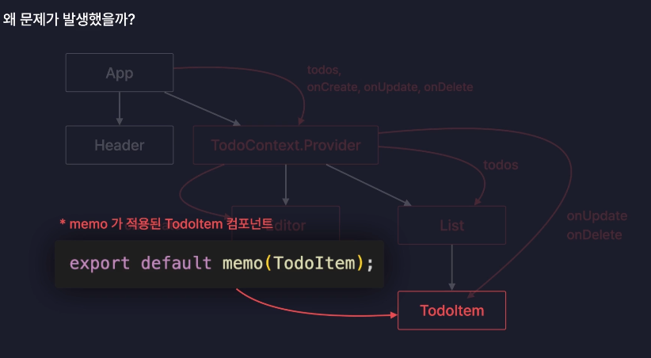
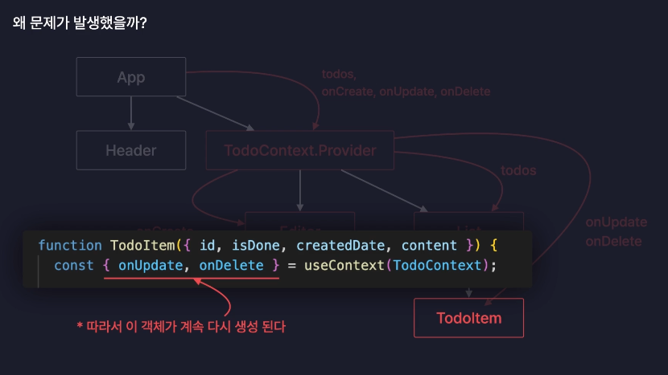
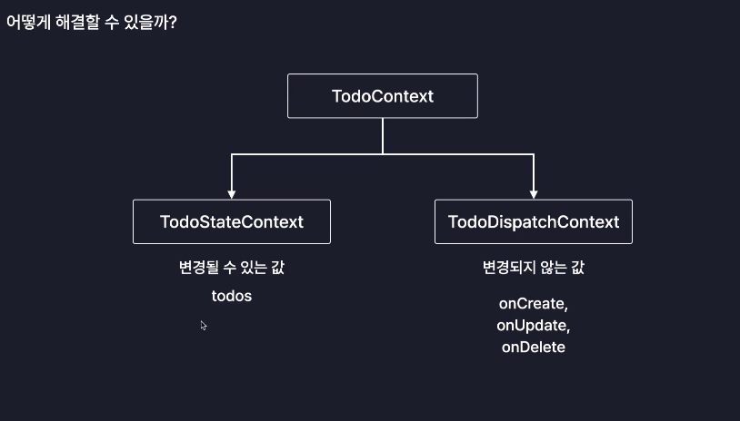
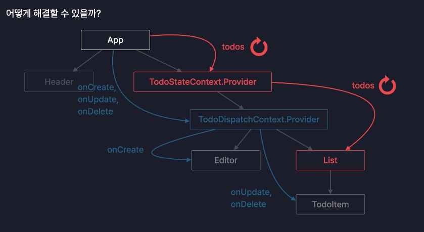

# Section 11. Context

## chapter 01. Context 란?

- 컴포넌트간의 데이터를 전달하는 또 다른 방법
- 기존의 Props가 가지고 있던 단점을 해결할 수 있음

### 1. Props의 단점: Props Drilling

- Props는 부모 -> 자식으로만 데이터를 전달할 수 있었다.
- 부모와 Props를 받는 자식 사이의 계층이 많아진다면(부모 -> 자식 1 -> 자식 2 ... -> 최종 자식) 모든 자식을 거쳐서 Props를 내려줘야 한다. 만약 중간에 Props의 이름이 바뀌기라도 하면 모든 자식 컴포넌트에서 바꿔줘야한다.
- 이러한 모습이 마치 Props가 땅을 파고 내려가는 것 같다고 해서 프롭스 드릴링(Props Drilling)이라고 한다.
- Context는 Props Drilling을 해결해주는 기능이다.

### 2. Context 란?

- Context는 데이터들을 보관하는 일종의 데이터 보관소 역할을 하는 객체이다.
- 컨텍스트를 새롭게 생성한 후에 전달하고자 하는 Props를 생성한 Context에 보관해 놓으면, 이제는 Props를 이용하지 않고 다이렉트로 필요한 자식 컴포넌트에 Props를 전달해 줄 수 있다.
  
- 컨텍스트는 여러개 만들 수 있어서 자식에 따라 다르게 공급할수도 있다.
  

<br>

## chapter 02. Context 사용하기

### 1. Context를 이용하여 Props Drilling 해결하기 실습

#### 1) 문제 상황

- App.jsx의 onUpdate, onDelete 함수가 App -> List -> TodoItem 컴포넌트로 전달되면서 Props Drilling 발생

#### 2) 데이터 공급하기 (부모 컴포넌트)

- App.jsx에서 Context를 생성. 그리고 export 해준다

  ```js
  import { createContext } from "react";

  export const TodoContext = createContext();
  ```

  - Context 생성은 보통 컴포넌트 외부에 선언한다. 컴퍼넌트가 리렌더링 될 때마다 계속 새로운 컨텍스트를 생성할 필요는 없기 때문이다.
  - TodoContext를 console.log로 들여다보면 내부 동작을 위한 다양한 프로퍼티들이 존재하는데 그 중 Provider라는 프로퍼티가 주로 쓰인다.

- **Provider 프로퍼티**? Context가 공급할 데이터와 Context의 데이터를 공급받을 컴포넌트를 설정할 때 사용하는 **컴포넌트**

  ```jsx
  <TodoContext.Provider value={{ data1, func1, func2, func3 }}>
    <ChildComponent1 />
    <ChildComponent2 />
  </TodoContext.Provider>
  ```

  - 공급받을 자식 컴포넌트를 Provider 컴포넌트로 감싼다.
  - 전달할 데이터들은 Provider 컴포넌트의 value 라는 Prop으로 설정한다.

  ```jsx
  // 실습 적용 예제
  <TodoContext.Provider value={{ todos, onCreate, onUpdate, onDelete }}>
    <Header />
    <Editor />
    <List />
  </TodoContext.Provider>
  ```

    

    

  - 이제 자손 컴포넌트들은 Context로 부터 데이터를 다이렉트로 불러와서 사용할 수 있다.

    

  - 리액트 개발자 도구에서도 Context.Provider가 자식 컴포넌트들을 감싸고 있고, props로 우리가 value로 공급한 함수와 값을 가지고 있는 것을 볼 수 있다.

#### 3) 데이터 꺼내쓰기(자식 컴포넌트)

- 데이터를 공급 받고자하는 자식 컴포넌트에서 (부모 컴포넌트에서 생성하고 export한) Context를 import 한다.
- 그리고 import한 Context를 자식 컴포넌트 내에서 useContext 훅의 인수로 넣어준다.

  ```js
  import { TodoContext } from "../App"; // 공급받은 Context
  import { useContext } from "react"; // Context로 부터 데이터를 꺼내 쓰기 위한 React Hook

  function ChildComponent() => {
    const data = useContext(TodoContext);

    return <>JSX</>
  }
  ```

  - useContext 훅은 생성된 Context로 부터 공급된 데이터를 반환해주는 함수이다.

- 이렇게 Context를 사용하면 useCallback과 React.memo로 적용해둔 최적화가 풀리는 문제 발생.

<br>

## chapter 03. Context 분리하기

### 1. Context를 사용하면 왜 최적화가 풀릴까?

- Provider 컴포넌트도 React의 컴포넌트. 따라서 부모 컴포넌트로부터 value props로 제공받는 객체가 변경되면(props가 변경되면) 리렌더링이 발생하게 된다.
  
- 자식 컴포넌트들의 입장에서는 부모 컴포넌트인 Provider 컴포넌트가 리렌더링 되는 것이기 때문에 자식 컴포넌트로써 함께 리렌더링 되는 것이다.
  
- 하지만 자식 컴포넌트에 자신이 받는 props가 변경되지 않으면 리렌더링 되지 않도록 React.memo로 최적화를 해둔 상태인데도 리렌더링이 발생하는 이유는,
  
- App 컴포넌트에서 전달하는 데이터 객체의 상태값(todos state)에 변경이 일어날 경우 App 컴포넌트가 리렌더링이 되는데, 이 때 Provider 컴포넌트가 value props로 전달하는 객체 자체가 다시 생성이 된다.
  
- 따라서 Context로 부터 value props로 전달받는 객체 자체가 다시 생성이 되기 때문에 자식 컴퍼넌트도 리렌더링이 발생하게 된다. 왜냐하면 React.memo를 적용했더라도 이렇게 useContext로 부터 불러온 값이 변경되면 props가 변경된 것과 동일하게 리렌더링을 발생시키기 때문이다.
  

### 2. 해결 방안

- 공급하는 Context를 2개의 Context로 분리해서 해결할 수 있다.
- 변경되는 값을 공급하는 Context와 변경되지 않는 값의 Context로 분리한다.
  
  - 이렇게 할 경우 todos의 변경이 일어나도 onCreate, onUpdate, onDelete는 바뀌지 않는다.
- 즉, 분리하여 공급하면 변경되는 값을 공급받는 자식 컴포넌트만 리렌더링이 일어난다.
  
  - 부모 컴포넌트가 리렌더링 되므로 원래라면 Editor와 TodoItem 모두 리렌더링 되는 것이 맞지만 React.memo를 적용하면 리렌더링이 일어나지 않는다.
