# Chapter 01. 프로젝트 소개 및 준비

- ESLint 옵션 추가

  ```cjs
  "no-unused-vars": "off",
  "react/prop-types": "off",
  ```

- 감정일기장 데모사이트 링크 :
  https://emotion-diary.winterlood.com/

<br>
<br>

# Chapter 02. 페이지 라우팅 - 1. 소개

### 1) 페이지 라우팅(Page Routing) 이란?

- 경로에 따라서 알맞은 페이지를 렌더링 하는 과정
  - (ex) /new -> new 페이지 렌더링
- 사용자(User), 브라우저(Client), 웹 서버(Server)가 있을 때,
  - 사용자가 블로그에 접속하기 위해 브라우저를 이용해서 웹 서버에 '/블로그' 같은 주소로 요청을 보낸다.
  - 웹 서버는 요청에 따라서 브라우저에게 블로그 페이지를 반환해주고 그리고 브라우저는 이렇게 반환된 블로그 헤이지를 사용자가 볼 수 있도록 렌더링 하는 모든 과정을 페이지 라우팅이라고 표현한다.
    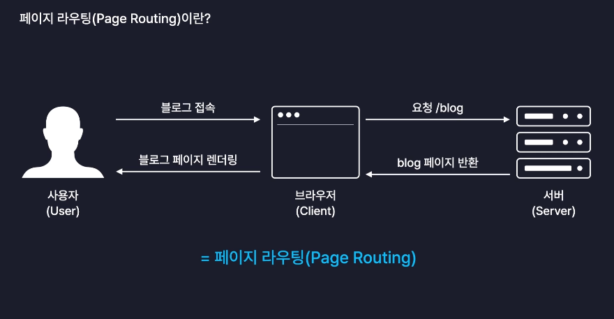

### 2) 페이지 라우팅의 원리

#### 1. MPA (Multi Page Applicaton, 멀티 페이지 어플리케이션)

- 전통적인 웹 서비스는 웹 서버가 사용자에게 제공해야 하는 모든 페이지들에 해당하는 HTML 파일들을 다 가지고 있다.
- 브라우저에서 "/블로그"와 같은 특정 주소를 같은 페이지를 요청하면, 서버는 해당 요청에 맞는 페이지를 찾아서 페이지 그대로 반환해준다.
- 서버로 부터 반환 받은 브라우저는 이 HTML 페이지를 그대로 화면에 렌더링 한다.
  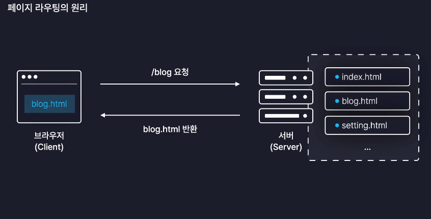

  => 이런식으로 애초에 서버가 사용자들에게 제공할 여러 개의 페이지를 미리 가지고 있는 방식을 **MPA** 라고 한다.

  => 동작 방식이 직관적이어서 현재까지도 많은 서비스가 사용하는 전통적인 방식

#### 2. 서버 사이드 렌더링(Server Side Rendering)

- MPA 방식에서 브라우저가 새로운 페이지를 요청했을 때 서버측에서 미리 완성해놓은 HTML 파일을 보내주면 브라우저가 그것을 그대로 렌더랑 하는 방식
- 즉, 서버 측에서 페이지를 미리 렌더링 해주는 방식

#### 3. MPA !== SSR

- MPA와 SSR은 같은 말이 아니다!
- MPA : 서버가 여러 개의 HTML 페이지를 가지고 있는 것
- SSR :(MPA 방식에서 브라우저가 페이지를 요청했을 때) 미리 완성되어 있는 페이지를 응답해 주는 방식
  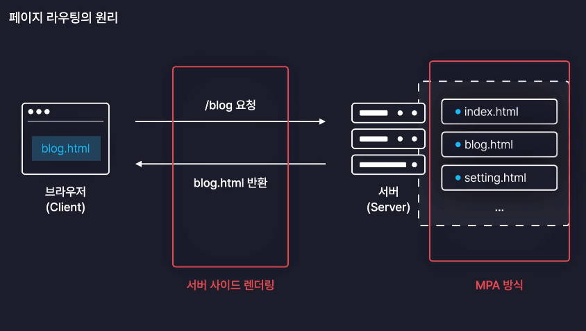

```
✅ 대다수의 전통적인 웹서비스들은 MPA 방식으로 서버가 다수의 웹페이지를 보유하고 있고 그리고 브라우저가 요청을 보내게 되면 서버 사이드 렌더링 방식으로 만들어진 페이지를 응답한다.
```

### 3) MPA 방식의 단점

- 리액트는 MPA 방식을 따르지 않는다. MPA 방식은 페이지의 이동을 빠르게 처리하기 어렵기 때문이다.

#### 1. 페이지 이동이 쾌적하지 못하다.

- 유저가 새로운 페이지로 이동하면 웹서는 또 실시간으로 적절한 HTML 파일을 찾거나 또는 실시간으로 만들어서 반환해준다. 그러면 브라우저는 원래 가지고 있던 페이지를 제거해버리고 새롭게 받은 페이지를 다시 렌더링하게 되면서 페이지 이동이 완료된다.
- 즉, 페이지를 이동할 때마다 원래 렌더링 해뒀던 페이지는 다시 다 지우고 아예 새로운 페이지를 받아와서 화면을 처음부터 다시 렌더링을 해준다.
- 이 과정에서 페이지가 마치 새로고침 되는 것처럼 한번 깜빡이게 된다.
  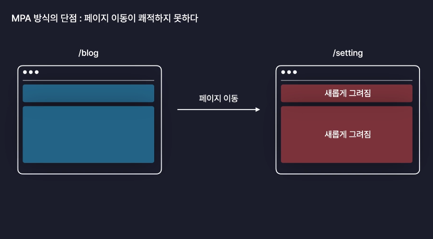
- 예시 : [대법원 사이트](https://www.scourt.go.kr/supreme/supreme.jsp_)
  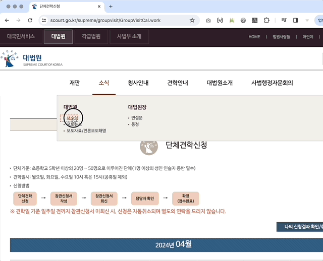
  - 새로운 페이지로 이동할때마다 화면이 조금씩 깜빡이고 새로고침 버튼도 활성화 되는 것을 볼 수 있다.

#### 2. 서버의 부하가 심해진다.

- 모든 사용자들이 페이지를 이동할 때마다 일일이 서버에게 새로운 페이지를 달라는 요청을 보내게 된다.
- 서버는 모든 요청들을 하나하나 다 처리해줘야 되기 때문에 동시에 아주 많은 사용자가 페이지에 접속할 경우에는 서버가 겪는 부하가 매우 심해진다.
- (ex) 수강신청이나 콘서트 티켓팅에서 대기열 발생, 서버 터짐..

```
✅ MPA의 단점 정리
1. 페이지 이동이 매끄럽지 않고 비효율적임
2. 다수의 사용자 접속시, 서버의 부하가 심해짐

=> 따라서 React는 MPA 방식 대신 SPA 방식으로 작동한다.
```

### 4) SPA(Single Page Application, 싱글 페이지 어플리케이션)

- 페이지 이동이 매끄럽고 효율적임
- 다수의 사용자가 접속해도 크게 상관 없음

#### 1. SPA 란?

- 단일 페이지 어플리케이션
- 따라서 웹서버가 페이지를 딱 한 개만 가지고 있다.
- 그리고 추가로 우리가 만든 리액트 컴포넌트들이나 기타 유틸 기능들이 작성되어 있는 자바스크립트 파일들도 함께 가지고 있다.
  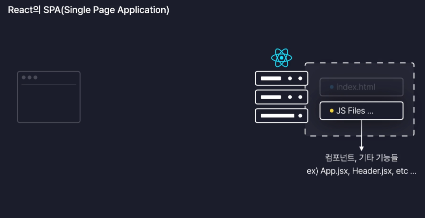

<br>

- SPA 방식으로 작동하는 리액트 웹서버에 사용자가 접속을 요청하게 되면 어떤 경로로 요청했던 관계없이 웹서버는 웹브라우저에게 무조건 index.html 파일을 보내준다.
- index.html 은 빈껍데기 역할로써 scipt 태그를 이용해서 mani.jsx 라는 리액트 코드를 가동시키는 역할만 수행한다.
- 브라우저는 index.html 파일만 받았으므로 화면에는 빈 흰색 화면만 먼저 렌더링 된다.
- 이때 후속으로 리액트 웹서버는 리액트 컴포넌트들이나 기능들이 작성되어 있는 모든 자바스크립트 파일들을 하나의 파일로 묶어서 브라우저에게 추가로 전달한다.

  - 이때 여러 개의 자바스크립트 파일들을 묶어주는 행위를 **번들링(Bundling)** 이라고 부른다.
  - 번들링 되어서 브라우저에게 전달되는 이 자바스크립트 파일을 실무에서는 번들 파일이라고 부른다.
  - 번들링은 Vite가 해준다.
    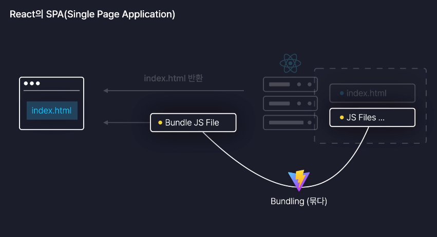

    <br>

- 이제 브라우저는 전달 받은 번들 파일을 직접 실행 한다.
  - 이때 React App의 `main.jsx` 파일이 가장 먼저 실행 되는데, 여기서 `render()` 메서드가 호출이 되면서 `<APP />` 컴포넌트를 화면에 실제로 렌더링 하게 된다. 이러면서 `<APP />` 컴포넌트 내에 있는 우리가 작성한 모든 컴퍼넌트들이 화면에 렌더링 된다.
    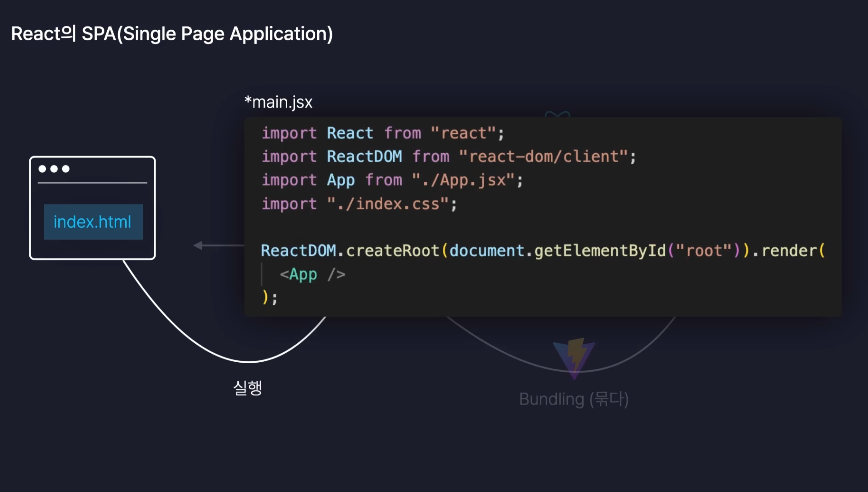
    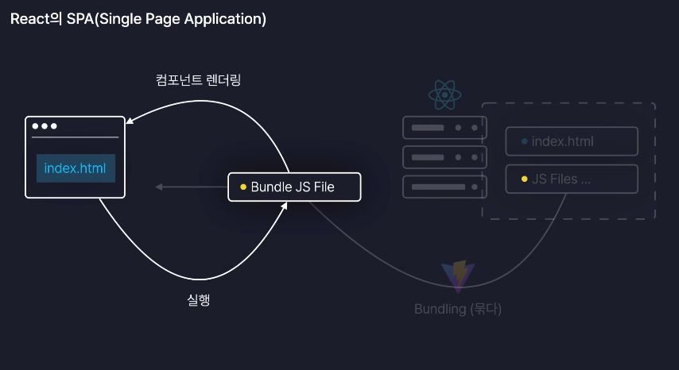

#### 2. CSR(Client Side Rendring, 클라이언트 사이드 렌더링)

- SPA 방식에서 처럼, 브라우저에서 직접 자바스크립트 파일을 실행해서 화면을 직접 렌더링하도록 하는 이러한 방식
- 클라언트 측인 브라우저에서 직접 렌더링을 처리한다라는 뜻

- 번들 파일은 우리가 직접 작성한 모든 리액트 컴포넌트들이 하나의 파일로 묶여있는 자바스크립트 파일이므로 사실상 이 파일을 리액트 앱이라고 부를 수 있다. 브라우저에서 실행되는 리액트 앱이라는 것.
  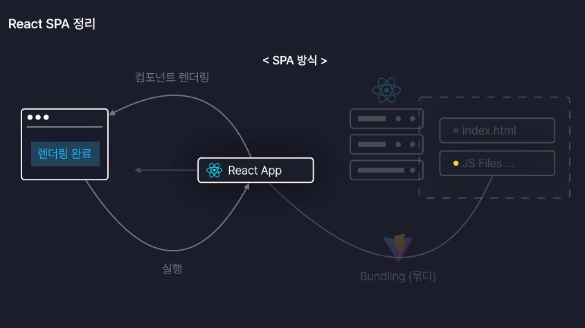

<br>

### 5) 정리

- 리액트는 서버기 직접 여러 개의 페이지를 모두 가지고 있는 전통적인 방식인 MPA 방식을 따르지 않는다. 대신 기본적인 틀 역할을 하는 페이지 딱 하나만을 가지고 있는 SPA라는 방식을 따른다.
  - 그렇게 때문에 리액트에서는 화면에 렌더링해야하는 요소들을 html 파일에 직접 작성하지 않고 자바스크립트에 컴포넌트라는 리액트만의 문법으로 작성한다.
- 브라우저에 접속 요청이 들어오면 웹서버는 먼저 기본 틀인 HTML 파일을 하나 보내준 다음에, 모든 자바스크립트 파일을 번들링 해서(전달해주기 편하도록 하나로 묶어서) 브라우저에 후속으로 보내준다.
  - 브라우저에서는 이 자바스크립트 파일을 직접 실행해서 파일에 작성된 컴포넌트들을 직접 화면에 렌더링하게 되면서 페이지가 실제로 렌더링이 이루어지게 된다.
  - 이때 번들링 된 자바스크립트 파일에는 우리가 리액트 문법으로 작성한 모든 정보들이 다 담겨있기 때문에 이 파일을 리액트 앱이라고 부룰 수 있다.
  - 따라서 리액트 웹서버는 브라우저가 접속 요청을 하면 번들링된 리액트앱을 그대로 브라우저에 전달해주는 역할을 할 뿐이다. 그리고 실제 이 리액트 앱은 브라우저에서 실행이 된다.
- 이렇게 동작하는 이유는 MPA 방식의 단점인 비효율적인 페이지 이동과 서버의 부하가 심해진다는 점들을 보완하기 위해서이다.

### 6) SPA의 페이지 이동

- SPA 방식에서는 사용자가 링크나 버튼을 클릭해서 새로운 페이지 이동이 발생하게 되면, 새로운 페이지를 매번 서버에게 요청했던 MPA 방식과는 달리 서버에게는 아무런 요청도 보내지 않는다.
  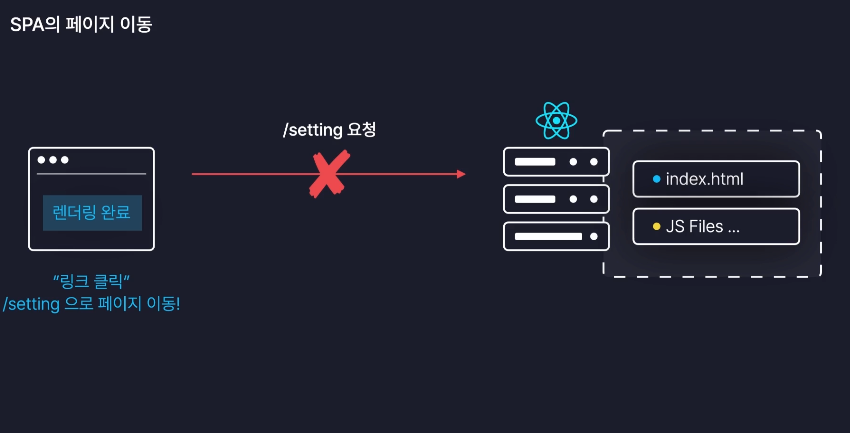
- 대신 우리가 처음 접속할 때 서버로부터 받았던 리액트 앱을 이용해서 자체적으로 브라우저 내에서 새로운 페이지에 필요한 컴포넌트들로 화면을 교체한다.
  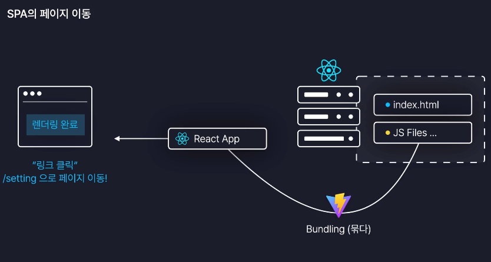
- 그럼으로써 아무런 요청도 없이 브라우저가 스스로 페이지를 이동시킨다.
- 이는 리액트 앱에 모든 자바스크립트 파일들의 정보가 번들링 되어 있기 때문에 리액트 문법으로 작성한 모든 페이지 정보도 다 포함이 되어 있기 떄문이다.
  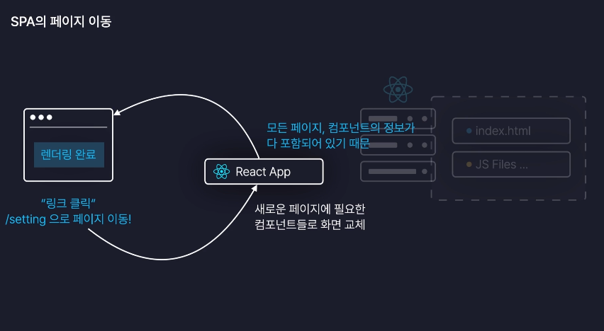
- 페이지 이동시에 화면에 모든 요소들이 다 컴포넌트로 이루어져 있기 때문에 공통 요소들은 그대로 냅두고 변경이 필요한 컴포넌트만 새롭게 갈아 끼운다.
- 이로인해 아주 신속하고 효율적으로 페이지를 업데이트 할 수 있다.
- MPA vs SPA
  - MPA : 페이지 이동 시 원본을 전부 제거하고 새롭게 렌더링 하기 때문에 새로고침 발생
  - SPA : 페이지 이동 시 공통 컴포넌트는 그냥 두고 꼭 필요한 컴포넌트만 교체해주기 때문에 아주 효율적인 방식으로 페이지 업데이트
    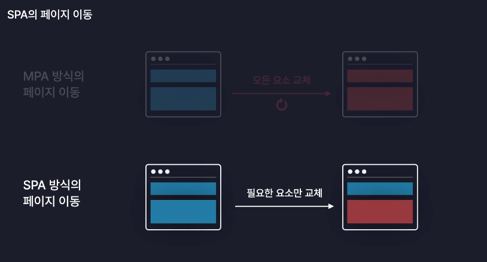
  - (예시) [React 홈페이지](https://ko.legacy.reactjs.org/) : 화면 깜빡임 없이 빠르게 페이지 전환, 새로고침 버튼도 활성화 되지 않는다.
    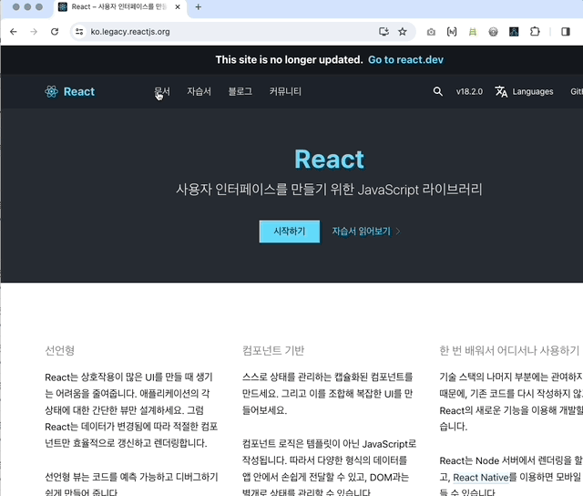

<br>
<br>

# Chapter 03. 페이지 라우팅 - 2. 라우팅 설정하기

### 1. React Router 란?

- npmjs.com에 등록되어 있는 라이브러리
- 대다수의 리액트 앱이 사용하고 있는 대표격 라이브러리

### 2. 사용법

- `npm i react-router-dom` 으로 설치하여 사용
- `package.json` 에서 버전 6.xx 대 이상으로 설치되었는지 확인
- `<BrowerRouter>`
  - 브라우저의 현재 주소를 저장하고 감지하는 역할.
  - `<App>` 컴포넌트를 감싸서 사용.
  - 내부에 `<Navigation.Provider>` 같은 Context 객체의 Provider 컴포넌트를 이용해서 `<App>` 컴포넌트 내 모든 자손 컴포넌트들에게 페이지 라우팅과 관련된 모든 데이터들을 공급받아서 사용할 수 있게 된다.
    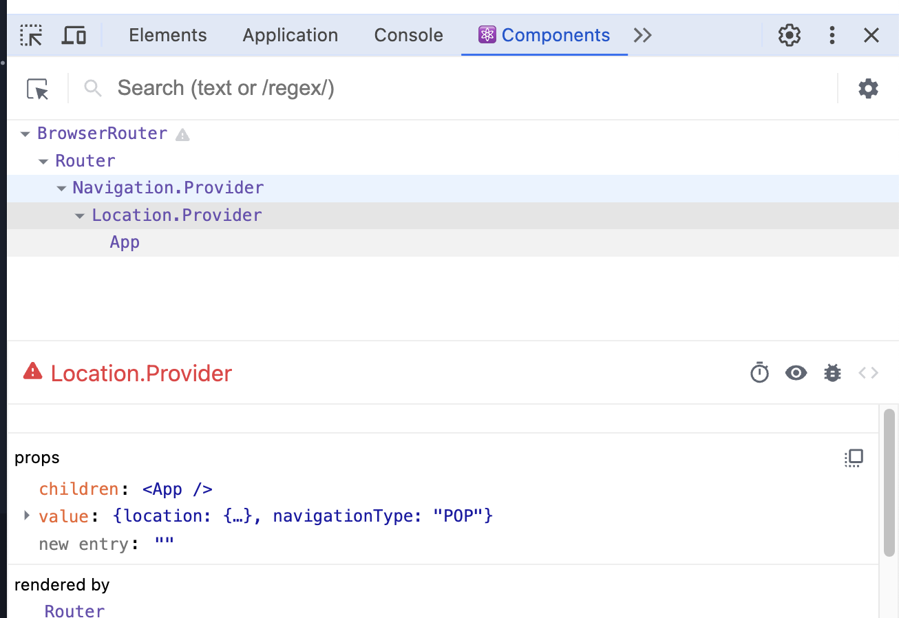
- `<Router>`의 `path`를 `*(와일드 카드)`로 설정하면 switch문의 default 와 같은 역할을 한다. (설정되지 않은 경로로 접속했을 때 보여줄 페이지)

### 3. 주의사항

- `<Routes>` 컴포넌트 안에는 `<Route>` 컴포넌트만 가능. 일반적인 `<div>` 같은 요소는 들어갈 수 없다.
- `<Routes>` 컴포넌트 외부에 베치시키면 모든 페이지에서 렌더링 된다.
  - `<Routes>` 컴포넌트 내부의 요소들만 페이지에 따라 다르게 렌더링 된다.

<br>
<br>

# Chapter 04. 페이지 라우팅 - 3. 페이지 이동

- React App에서 페이지를 이동시키는 방법

### 1. `<Link>` 컴포넌트

- React Router에서 제공하는 컴포넌트

- `<a>` 태그는 페이지 이동 시 새로고침이 발생하지만(CSR 지원❌) `<Link>` 컴포넌트는 새로고침 없이 페이지를 이동시킬 수 있다.
  ```jsx
  <Link to={"/"}>Home</Link>
  <Link to={"/new"}>New</Link>
  <Link to={"/diary"}>Diary</Link>
  ```

### 2. useNavigate 훅

- React Router에서 제공하는 훅
- **특정 이벤트가 발생했을 때** 함수를 이용하여 페이지를 이동시킬 수 있다.
- CSR 방식으로 동작하기 때문에 페이지 이동 시 새로고침이 발생하지 않는다.

  ```jsx
  // 1. useNavigate 호출 시 반환되는 함수를 이용한다.
  const nav = useNavigate();

  function onClickButton = () => {
    // 2. 함수 인수로 이동하고자 하는 경로를 넣어준다.
    nav("/new")
  }
          // 3. button의 onClick 이벤트로 페이지 이동 함수를 호출한다.
  return <button onClick={onCickButton}>New 페이지로 이동</button>
  ```
