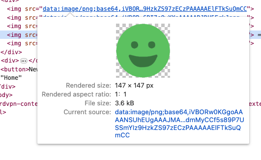
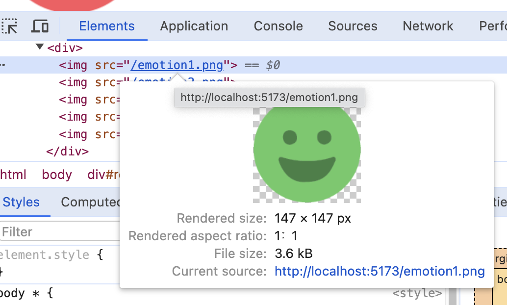
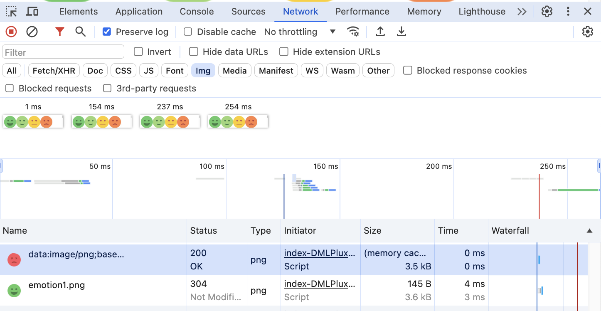

## 1. 폰트 설정하기

1. 폰트 파일을 정적 폴더인 public 폴더에 넣어준다.
2. index.jsx 에서 폰트를 설정한다.

```css
@font-face {
  font-family: "NamumPenScript"; /*  아무 이름이나 가능 */
  src: url("/NanumPenScript-Regular.ttf"); /*  확장자까지 파일명 그대로 넣어주기 */
}

body * {
  font-family: "NamumPenScript";
}
```

<br>

## 2. 이미지 설정하기

1. 이미지들을 assets 폴더에 넣어준다.

2. 필요한 컴포넌트에서 import 문으로 불러온다.

```jsx
// 이미지 불러오기
import emotion1 from "./assets/emotion1.png";

function Component() {
  // 이미지 렌더링 하기
  return ;
}
```

## 2 - 1. public 폴더 VS. assets 폴더

- `npm run build` 후에 `npm run preview`로 결과물을 비교해본다.

### 1. assets 폴더 + import문

- 한번 불러온 이미지들을 다시 불러오지 않도록 브라우저의 캐시를 이용해서 이미지를 최적화 하는 방법

```jsx
// 이미지 불러오기
import emotion1 from "./assets/emotion1.png";

function Component() {
  // 이미지 렌더링 하기
  return ;
}
```

- assets 폴더에서 import 문으로 불러온 이미지의 경로는 URI 포맷으로 되어 있다. URI 포맷으로 이미지 주소를 설정하게 되면, 이렇게 불러온 이미지들은 자동으로 우리 브라우저의 메모리에 캐싱(저장)되어서 새로고침 하더라도 다시는 불러오지 않도록 최적화가 된다.
  

  ### 2. public폴더 + "일반 경로"

  ```jsx
  function Component() {
    // 이미지 불러오기 + 렌더링 하기
    return ;
  }
  ```

- 이미지의 경로가 일반 주소로 되어 있다.
  
- 이렇게 불러온 이미지들은 새로고침 할 때마다 매번 새롭게 불러오기 때문에 데이터 소모가 발생한다.

  ### 3. public폴더 vs assets폴더

- 개발자도구의 Network 탭에서 `Preserve log`에 체크하고 `img` 필터를 건 후에 새로고침 해보면, public 폴더의 이미지는 불러오는 이미지 사이즈가 명시되어 있고 `Time`도 소요되지만 URI 포맷은 `Size`가 memory cache 되어 다시 불러오지 않기 때문에 `Time`도 0인 것을 볼 수 있다.
  
- 다만 assets 폴더에서 불러오는 것은 브라우저의 메모리를 소요하므로 1만장 정도의 수많은 이미지를 불러오는데에는 적합하지 않다.
- 많은 이미지를 사용할 때에는 public 폴더에서 불러오는 것이 적절하다.

## 2 - 2. 여러장의 이미지 불러오기 모듈화

- JSX 파일별로 매번 import문 작성하기 번거로우므로 이미지를 불러오는 코드를 별도의 모듈로 분리 => getEmotionImage 함수 생성
