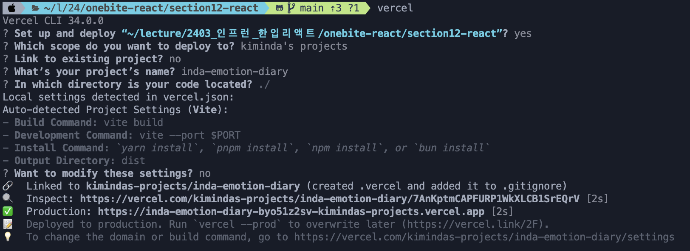

# chapter 18. 배포 준비하기

## Ⅰ. 배포 준비를 위해 해야 할 작업

1. 페이지 타이틀 설정하기

- 웹 브라우저 탭에 표시되는 페이지별 제목

1. Favicon 설정하기

- 웹 브라우저 탭에 표시되는 작은 아이콘

1. 오픈 그래프 태그 설정하기

- 오픈 그래프(Open Graph) : 웹 사이트의 링크를 공유할 때 썸네일, 제목 등의 정보를 노출하는 것

1. 프로젝트 빌드(build)

 

# chapter 19. 배포하기

### Ⅰ. 사이트 가입

### Ⅱ. 배포하기

1. 프로젝트 터미널에서 `vercel login` 으로 로그인. 가입한 수단으로 진행.

- `zsh: command not found: vercel` 오류 시 `npm i -g vercel` 로 설치 후 로그인

2. 터미널에 `vercel` 입력하면 아래와 같은 질문들 메세지가 뜸.
   

   - 프로젝트 경로 확인⭐️ 후 **Y** 선택
   - 배포할 vercel 계정 확인 -> 로그인한 계정 선택
   - 이미 존재하는 프로젝트에 연결할 것인지? -> 새로 배포하는 거면 **N** 선택
   - 프로젝트 이름 입력
   - 배포할 코드 위치가 어디인지? -> 기본값인 `./` 입력
   - vercel이 우리가 리액트 앱에 사용한 툴들을 알아내서 자동으로 설정하는 표시
   - 위에서 표시한 설정을 변경하고 싶냐는 질문 -> **N**
   - 빌드 후 배포 완료 되고, 배포 주소를 알려줌

3. 수정이나 업데이트 이후에도 `vercel`로 동일하게 수정 배포 진행
